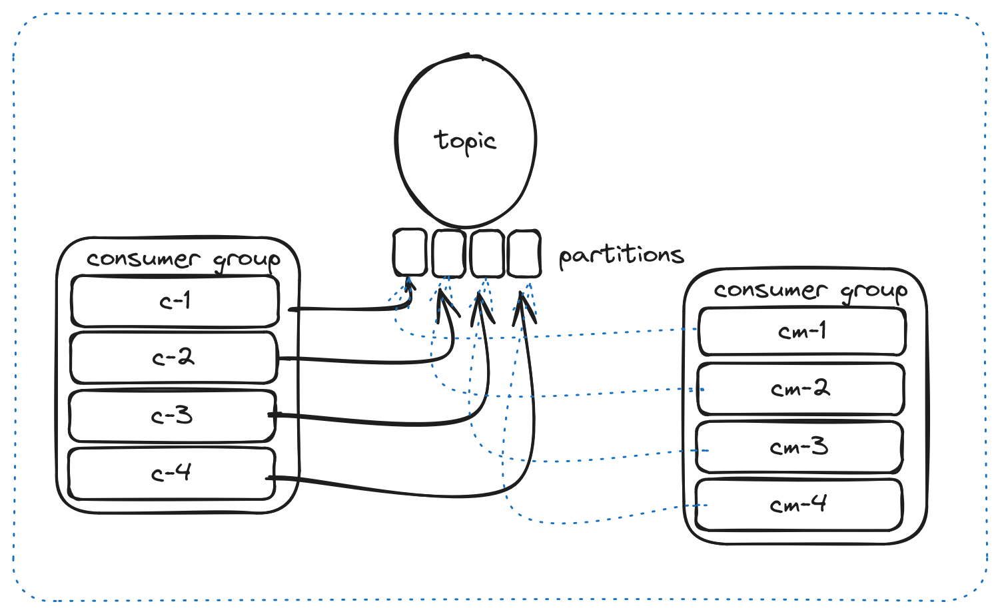

## Kafka Nasil Calisir? 

ilk olrak bir tane topic olusturulur. 
Bu asamada topicin kac tane parcaya bolunmesi gerektigine dair bir deger girilir (partition).
ornek olarak elimizde bir tane topic olsun 4 partitiona bolunmus halde. Bu topige mesaj geldiginde ilk olarak 
1 . partitiona yazar, tekrar bir mesaj geldiginde bu sefer 2. partitiona yazar ve bu sekilde ilerler, partition kullanmamizin esas nedeni
mesajlari paralel olarak isleyebilmek. bir partition yalnizca bir consumer tarafindan dinlenebilir ancak bir consumer birden fazla partitionu dinleyebilir.
ancak consumer grup olmasi halinde bir partition birden fazla consumer tarafindan dinlenmis olacaktir. 

