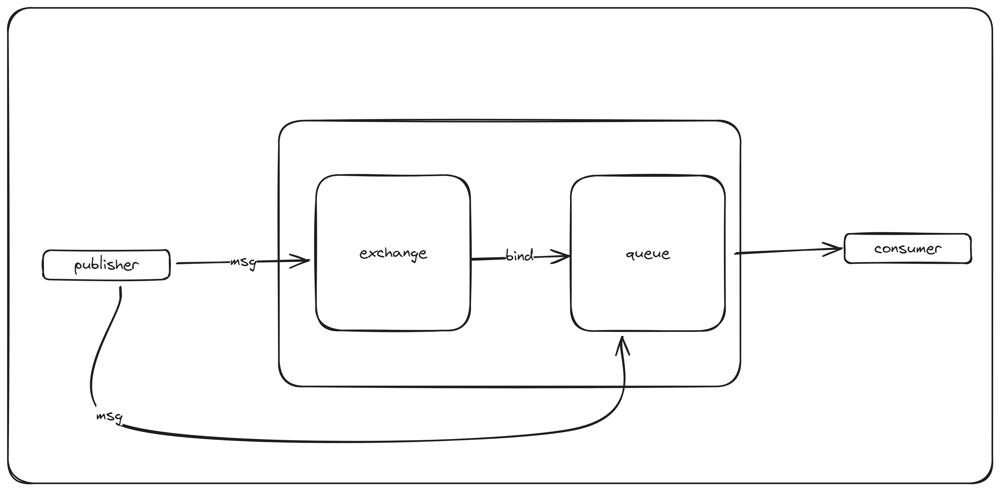

### Direct Exchange

---

Herhangi bir exchange olusturuldugunda bunu bi queue'ya bind etmek gerekir...



> Mesajlari kuyruga yada exchange'e gonderebiliriz ancak mesajlari almak icin kuyruklari dinlememiz gerekir, bunun icin de kuyruklari exchange'lere bind etmek gerekir.
> 
> 



Eger consumer sayisi birden fazla ise gonderilen her mesaj yalnizca bir tane consumer'a iletilir.  