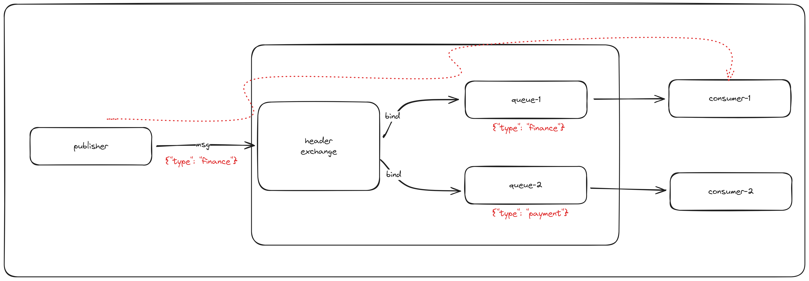

### Headers Exchange 

---

headers parametresi ile olusturulan exchange'e bind edilen bir kuyrukta
mesaj exchange'e gonderilir ancak mesaj gonderilirken mesaj icerisinde 
header alani doldurulur. 

kuyruklar exchange'e bind edilirken ne tur bir eslesme ile hangi kuyruga yonlendirilecegine
dair filtrelemeler yapilabilir. 

exchange'e gelen mesajlardaki header bilgisine gore ilgili kuyruga 
yonlendirme yapilir. 

eslesme icin birden fazla yontem bulunur

```text

"x-match":"all" -> butun headerlarin eslemesi gerekir

"x-match":"any" -> sadece bir tane headerin eslesmesi yeterlidir

"x-match":"none" -> hicbir headerin eslesmemesi gerekir
```

ornek header 

````text
"x-match":"all",
"type": "finance"
````

type headeri finance olan kuyruga iletilecek bir mesaj headeri bu sekilde gorunur. 


