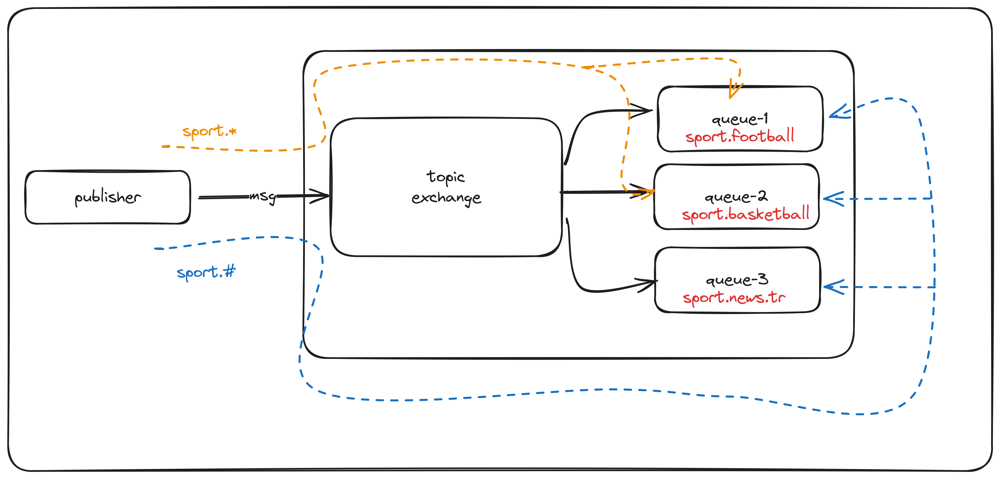

### Topic Exchange

---

topic exchange'de bir konu olusturulur ve o konuyu dinleyen kuyruklara mesaj iletilir.

konular olusturulurken (*) ve (#) ozel karakterleri kullanilarak eslestimede kullanilir.

- (*) ifadesi tek bir kelimeyi temsil eder.
- (#) ifadesi bir veya daha fazla kelimeyi temsil eder.

ornek olarak; 

```text
sport.football
sport.basketball
sport.tennis

```

yukaridaki isimlerde uc tane kuyruk olusturdugumuzu varsayalim ayni mesajin bu uc kuyruga iletilmesi icin
asagidaki ifade kullanilabilir. 

```text
sport.*
```

---

```text
sport.football.usa
sport.football.uk
sport.football.fr

sport.basketball.usa
sport.basketball.uk
sport.basketball.fr
```

yukaridaki isimlerde kuyruklar olusturdugumuzu varsayalim, bu kuyruklardan sport ile baslayan kuyruklara mesaj
gonderebilmek icin asagidaki ifade kullanilabilir

```text
sport.#
```


